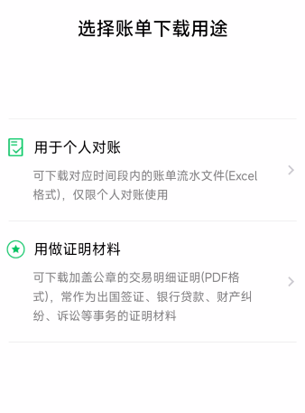
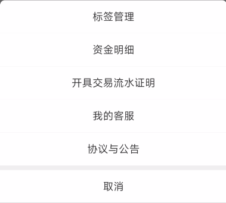
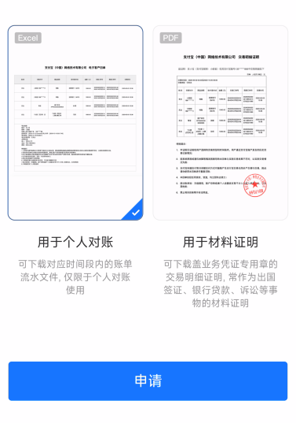

# 个人账单管理(Bill Manager)
 

本`README`由`chatgpt`辅助完成

## 项目简介

`bill_manager`是一个用于管理账单的Python项目，它能方便地导入支付宝、建设银行和微信的账单，并对账单进行分类和统计。此外，它还提供一些便捷的账单管理辅助工具(待开发)。项目通用性强，适用于个人使用。

## 文件结构及功能说明：

- Bill Manager
  - `main.py`: 启动应用的主程序
  - `data`: 数据存储路径
  - `utils`: 存放用于账单管理的具体实现代码的文件夹
    - `util.py`: 支持通用的账单处理函数
    - `alipay.py`: 处理支付宝账单
    - `ccb.py`: 处理建设银行账单
    - `wechat.py`: 处理微信账单

## 如何使用
1. 运行`start.py`或者启动打包后的`Bill Manager.exe`
2. 根据窗口提示选择需要输出的`xlsx`表格地址和原始账单位置
3. 运行结束后会打开之前输出的表格文件查看，账目汇总在工作簿-流水表，没有问题即可关闭，结束本次运行。

### 注意事项：

1. 原始账单地址下需要有微信，支付宝，建行三个文件夹
2. config.json文件存放有配置参数，修改后三项bool值可以选择导入的账单类型

### 配置文件参数

- `write_path`: 汇总流水账表格路径
- `read_path`: 原始账单路径
- `wechat`: 是否读取微信账单
- `alipay`: 是否读取支付宝账单
- `ccb`: 是否读取建行账单

## 如何导入原始账单
### 微信账单
 
微信支付➡️

➡️我的账单➡️

➡️账单明细➡️

➡️常见问题➡️

➡️下载账单➡️

➡️用于个人对账

选择对应时间，微信会将账单以压缩包形式发送至指定邮箱，解压密码会在支付消息里发布

将解压后的csv文件移动到 `$原始账单$/微信/`路径下即可

### 支付宝
 
我的➡️

➡️账单➡️

➡️ **···** ➡️

➡️开具交易流水证明➡️

➡️用于个人对账

输入支付密码后，选择对应时间，支付宝会将账单以压缩包形式发送到指定邮箱

将解压后的csv文件移动到`$原始账单$/支付宝/`路径下即可

## 贡献者
@noctboat

如有使用或问题，欢迎联系贡献者。
