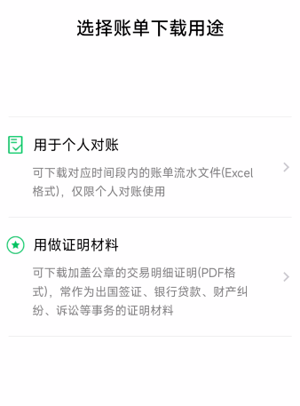
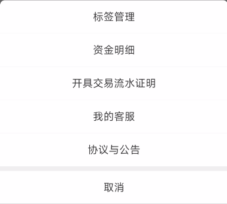
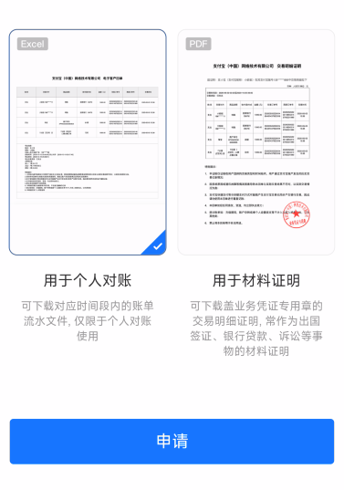

# 个人账单管理(Bill Manager)
 

本`README`由`chatgpt`辅助完成

## 项目简介

`bill_manager`是一个用于管理账单的Python项目，它能方便地导入支付宝、建设银行和微信的账单，并对账单进行分类和统计。此外，它还提供一些便捷的账单管理辅助工具(待开发)。项目通用性强，适用于个人使用。

## 文件结构及功能说明：
- root
  - `requirements.txt`
  - `img/` 存在icon图片和其他图片文件
  - `src/bill-manager/` 项目源代码
    - `main.py`: 启动应用的主程序
    - `utils/`: 存放用于账单管理的具体实现代码的文件夹
      - `util.py`: 支持通用的账单处理函数
      - `alipay.py`: 处理支付宝账单
      - `ccb.py`: 处理建设银行账单
      - `wechat.py`: 处理微信账单

## 安装

1. 克隆本仓库到本地。安装所需的 Python 库，可通过以下命令进行安装`pip install -r requirements.txt`
2. 下载[发行版](https://github.com/UniMars/Bill-Manager/releases)

## 如何使用
1. 运行`main.py`或者启动打包后的`Bill Manager.exe`
2. 根据窗口提示选择需要输出的`xlsx`表格地址和原始账单位置
3. 运行结束后会打开之前输出的表格文件查看，账目汇总在工作簿-流水表，没有问题即可关闭，结束本次运行。

### 注意事项：

1. 原始账单地址下需要有对应账单类型的文件夹(微信 支付宝 建行)
2. config.json文件存放有配置参数，修改后三项bool值可以选择导入的账单类型

### 配置文件参数

该项目中的 `config.json` 配置文件用于存储一些参数，以便在程序运行时快速加载。配置文件中包含以下参数：

- `read_path`: 存储原始账单的文件夹路径，可通过修改该参数来更改账单读取路径。
- `write_path`: 存储生成的记账表格的路径，可通过修改该参数来更改表格输出路径。
- `wechat`: 是否启用微信账单的读取和处理，默认为 `true`。
- `alipay`: 是否启用支付宝账单的读取和处理，默认为 `true`。
- `ccb`: 是否启用建设银行账单的读取和处理

若用户第一次运行程序，则配置文件中的参数为空。程序会提示用户输入账单读取路径和表格输出路径，并根据用户的选择来确定是否需要读取建设银行账单。用户在程序运行后，可以在配置文件中查看和修改参数的值，以方便下一次的使用。

注意：在修改参数之后，需要重新运行程序，以使新的参数生效。

## 如何导入原始账单
### 微信账单
 
微信支付➡️

➡️我的账单➡️

➡️账单明细➡️

➡️常见问题➡️

➡️下载账单➡️

➡️用于个人对账

选择对应时间，微信会将账单以压缩包形式发送至指定邮箱，解压密码会在支付消息里发布

将解压后的csv文件移动到 `$原始账单$/微信/`路径下即可

### 支付宝
 
我的➡️

➡️账单➡️

➡️ **···** ➡️

➡️开具交易流水证明➡️

➡️用于个人对账

输入支付密码后，选择对应时间，支付宝会将账单以压缩包形式发送到指定邮箱

将解压后的csv文件移动到`$原始账单$/支付宝/`路径下即可

## 贡献者
作者：@UniMars

联系方式：请在本仓库提交 issue。

## 许可证
本项目采用 MIT 许可证。
